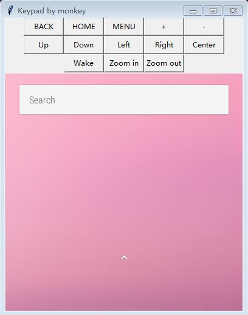

# android_screen
show android screen and input keyevent and touch event


# Thread 1: Capture screen and show
```shell
adb shell screencap -p
```
Depend screencap cmd,we can get the screen of android

# Thread 2: Monkey keypad thread
1. start monkey port
```
adb shell monkey --port 1080
```
2. start event input thread
```
adb shell busybox telnet 127.0.0.1:1080

```
Refer to:

https://android.googlesource.com/platform/development/+/master/cmds/monkey/README.NETWORK.txt


we can input like:

key down menu

key [down|up] keycode

touch [down|up|move] x y


we can input key event to monkey network server.
The monkey input benefit is fast than adb shell input event 

3. gui thread
use tkinter draw buttons and canvas for show screen

Image example:




## Knows issue

1. Monkey server create fail

2. swipe action is too fast

   due to monkey support: touch down|up|more x y

   when we input a move action. it not have transition

